<h1>
    
    Hey there, nice to see you.
</h1>

    <a href="https://x.com/oderahub" target="_blank"
        >
    <a href="https://www.linkedin.com/in/oderahub/" target="_blank"
        >
    <a href="mailto:okere_chidera@yahoo.com" target="_blank"
        >
    <a
        href="https://marketplace.visualstudio.com/publishers/oderahub"
        target="_blank"
        ></a
    >
    
    
    

 

👋 Hi, I'm [Chidera](https://github.com/oderahub), a MERN Blockchain Software Engineer. I'm passionate about turning code into creative solutions, well-crafted systems, and exploring technology's balance between function and form.
 

<h3>
    
    About Me...
</h3>

- 👀 I'm interested in turning code into creative solutions, well-crafted systems, and technology's balance between function and form.
- 🌱 I'm currently learning and building software solutions.
- 💻 Open to exciting opportunities in blockchain, backend, and full-stack development.
- 💞️ I'm looking to collaborate on projects that blend creativity and tech or anything that needs a curious mind.
- ⚡ Fun fact: Fueled by curiosity, I'm probably the type to debug code to see how elegantly I can rewrite it.
- 📫 How to reach me: [okere_chidera@yahoo.com](mailto:okere_chidera@yahoo.com)

## 📊 Github Stats

<table><tr><td valign="top" width="50%">

 

</td><td valign="top" width="50%">

</td></tr></table>

<table><tr><td valign="top" width="50%">

<!-- </td><td valign="top" width="50%">

</td></tr></table> -->

<h2>
    
    Development Stats
</h2>

## 🛠️ Languages and Tools

  
  
  
  
  
  
  
  
  
  

## 🔥 GitHub Streak

  

## 📈 Contribution Graph

  

---

  

  

---
